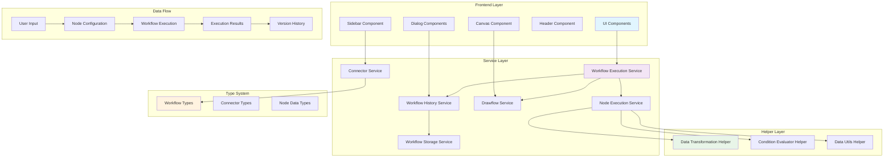

# Angular Circuit Craft 🔧⚡

Angular Circuit Craft is a powerful visual workflow automation platform built with Angular 20. Create, execute, and manage complex data workflows through an intuitive drag-and-drop interface with real-time execution capabilities, comprehensive version control, and advanced data transformation features.

## ✨ Features

### Core Functionality
- **Visual Workflow Editor**: Intuitive node-based editor using Drawflow with modern UI
- **Real-time Execution**: Execute workflows with live data processing and visualization
- **Smart Node System**: 7+ pre-built node types for HTTP, data transformation, logic control, and more
- **Data Transformation**: Advanced field mapping with direct copy, constant values, and computed expressions
- **Conditional Logic**: If/else branching with flexible condition evaluation
- **Data Visualization**: Built-in table and JSON viewers for data inspection

### Advanced Features
- **Workflow Management**: Save, load, and manage multiple workflow configurations
- **Live Data Preview**: Real-time data preview and debugging capabilities
- **Node Configuration**: Rich configuration dialogs with form validation
- **Execution Tracking**: Visual execution states with success/error indicators
- **Zoom Controls**: Pan and zoom for complex workflow visualization
- **Modern Architecture**: Clean, maintainable codebase with separation of concerns

### Version Control & History
- **Workflow History**: Complete version tracking with detailed change logs
- **Version Comparison**: Compare different workflow versions with diff analysis
- **Execution History**: Track all workflow executions with performance metrics
- **Restore Capability**: Restore any previous version of a workflow
- **History Statistics**: Analytics on workflow changes and execution patterns
- **Filtered History**: Filter history by change type, date range, and author

### Data Processing Capabilities
- **HTTP Request Node**: Full REST API support with headers, body, and timeout configuration
- **Transform Node**: Advanced data mapping with three transformation types:
  - **Direct Copy**: `data.field → target.field`
  - **Constant Values**: Static values assignment
  - **Computed Expressions**: JavaScript expressions like `data.price * 1.2`
- **Display Data Node**: Multiple output formats (table, JSON, raw)
- **Conditional Logic**: If/else branching with flexible expression evaluation
- **Delay Node**: Timed execution delays for workflow orchestration
- **Email Node**: SMTP email notifications
- **Database Node**: Database connectivity and query execution

### User Interface Features
- **Modern Design**: Clean, professional interface with subtle animations
- **Responsive Layout**: Works on desktop and tablet devices
- **Dark Mode Ready**: Prepared for dark theme implementation
- **Accessibility**: Keyboard navigation and screen reader support
- **Visual Feedback**: Clear execution states and error handling
- **Search & Filter**: Advanced node search and category filtering
- **Drag & Drop**: Intuitive workflow building experience

## 🚀 Technologies Used

- **Frontend**: Angular 20 (Standalone Components)
- **Workflow Engine**: Drawflow + @ng-draw-flow/core
- **Styling**: Tailwind CSS 4.1.4 + DaisyUI 5.0.27
- **Icons**: Material Icons + Heroicons + NgIcons
- **Architecture**: Service-oriented with helper functions
- **Type Safety**: Full TypeScript implementation
- **State Management**: RxJS BehaviorSubject for reactive state
- **Build Tools**: Angular CLI 20 + PostCSS + ESLint

## 🏗️ Architecture



### Component Architecture

```
src/app/
├── components/                    # UI Components
│   ├── header/                   # Top navigation and controls
│   ├── sidebar/                  # Node palette and search
│   ├── canvas/                   # Main workflow canvas
│   ├── bottom-toolbar/           # Bottom controls and status
│   └── dialogs/                  # Modal dialogs
│       └── workflow-history-dialog/  # Version control interface
├── services/                     # Core Business Logic
│   ├── workflow-execution.service.ts    # Workflow orchestration
│   ├── node-execution.service.ts        # Individual node execution
│   ├── drawflow.service.ts              # Canvas operations
│   ├── workflow-storage.service.ts      # Persistence layer
│   ├── workflow-history.service.ts      # Version control
│   ├── workflow.service.ts              # Workflow management
│   └── connectors.service.ts            # Node templates
├── helpers/                      # Pure Utility Functions
│   ├── data-transformation.helper.ts    # Data mapping logic
│   ├── condition-evaluator.helper.ts    # Logic evaluation
│   └── data-utils.helper.ts             # Data manipulation
├── types/                        # TypeScript Definitions
│   ├── workflow/                 # Workflow-related types
│   ├── connectors/               # Connector system types
│   └── node-data.type.ts         # Node data structures
└── app.component.ts              # Main application orchestrator
```

## 🎯 Node Types & Capabilities

### HTTP & APIs
- **HTTP Request**: Make REST API calls with full header and body support
  - Configurable timeout settings
  - Multiple HTTP methods (GET, POST, PUT, DELETE)
  - Custom headers and request body
  - Error handling and response validation

### Data & Transformation
- **Display Data**: Visualize data in table, JSON, or raw formats
  - Real-time data preview
  - Multiple display formats
  - Interactive data exploration
- **Transform**: Advanced field mapping with computed expressions
  - Direct field mapping
  - Constant value assignment
  - JavaScript expression evaluation
  - Nested object support

### Logic & Control
- **If Condition**: Conditional branching with flexible expressions
  - Complex boolean logic
  - Multiple condition types
  - Dynamic path selection
- **Delay**: Timed execution delays
  - Configurable delay duration
  - Non-blocking execution
  - Workflow orchestration support

### Notifications & Storage
- **Send Email**: Email notifications via SMTP
  - Template-based emails
  - Dynamic content injection
  - Multiple recipient support
- **Database**: Database connectivity and queries
  - SQL query execution
  - Connection management
  - Result processing

## 📋 Prerequisites

- Node.js 18+
- npm or pnpm
- Modern web browser with ES2022 support

## 🔧 Installation

```bash
# Clone the repository
git clone https://github.com/DiogoM14/angular-circuit-craft.git
cd angular-circuit-craft

# Install dependencies
npm install

# Start development server
npm start
```

Navigate to `http://localhost:4200/`

## 💻 Usage Guide

### Creating Your First Workflow

1. **Add Nodes**: Drag nodes from the sidebar to the canvas
2. **Connect Nodes**: Click and drag between node connection points
3. **Configure**: Double-click nodes to open configuration dialogs
4. **Execute**: Click the play button to run your workflow
5. **Save**: Use the save button to persist your workflow

### Advanced Workflow Management

#### Version Control
- **View History**: Access complete workflow version history
- **Compare Versions**: Side-by-side comparison of workflow changes
- **Restore Versions**: Revert to any previous workflow version
- **Execution Tracking**: Monitor performance and success rates

#### Data Transformation
- **Field Mapping**: Map input fields to output fields
- **Computed Values**: Use JavaScript expressions for dynamic values
- **Data Validation**: Ensure data integrity across transformations
- **Preview Mode**: Test transformations before execution

### Example Workflows

#### API Data Processing
```
HTTP Request → Transform → Display Data
```

#### Conditional Processing
```
HTTP Request → If Condition → [True: Transform, False: Email]
```

#### Timed Operations
```
HTTP Request → Delay → Email Notification
```

#### Complex Data Pipeline
```
HTTP Request → Transform → If Condition → [True: Database, False: Email] → Display Data
```

## 🎨 UI/UX Features

- **Modern Design**: Clean, professional interface with subtle animations
- **Responsive Layout**: Works on desktop and tablet devices
- **Dark Mode Ready**: Prepared for dark theme implementation
- **Accessibility**: Keyboard navigation and screen reader support
- **Visual Feedback**: Clear execution states and error handling
- **Interactive Canvas**: Pan, zoom, and navigate complex workflows
- **Real-time Updates**: Live execution status and data preview

## 🔍 Data Transformation

The transform node supports three mapping types:

- **Direct Copy**: `data.field → target.field`
- **Constant Values**: Static values
- **Computed Expressions**: JavaScript expressions like `data.price * 1.2`

### Advanced Features
- **Nested Object Support**: Access deeply nested properties
- **Array Processing**: Handle array data structures
- **Type Conversion**: Automatic data type handling
- **Error Handling**: Graceful failure with detailed error messages

## ⚙️ Development

### Code Quality
```bash
npm run lint      # ESLint checking
npm run format    # Prettier formatting
npm run test      # Unit tests
```

### Building
```bash
npm run build           # Production build
npm run build:stats     # Bundle analysis
```

### Architecture Principles

- **Single Responsibility**: Each service has a focused purpose
- **Pure Functions**: Helpers are side-effect free
- **Type Safety**: Comprehensive TypeScript coverage
- **Separation of Concerns**: UI, business logic, and utilities clearly separated
- **Reactive Programming**: RxJS for state management
- **Component Composition**: Standalone components for modularity

## 🚀 Performance

- **Lazy Loading**: Components loaded on demand
- **Efficient Rendering**: Optimized change detection
- **Memory Management**: Proper cleanup and subscription handling
- **Bundle Size**: Optimized with tree-shaking
- **Execution Optimization**: Parallel node execution where possible
- **Caching**: Intelligent result caching for repeated executions

## 🤝 Contributing

We welcome contributions! Please:

1. Fork the repository
2. Create a feature branch (`git checkout -b feature/amazing-feature`)
3. Follow the existing code style and architecture patterns
4. Add tests for new functionality
5. Update documentation as needed
6. Submit a pull request

### Code Style Guidelines

- Use Angular style guide conventions
- Prefer composition over inheritance
- Write self-documenting code with clear variable names
- Add JSDoc comments for public APIs
- Follow TypeScript strict mode guidelines
- Use RxJS operators for reactive programming

## 🐛 Known Issues & Roadmap

### Current Limitations
- Browser-based execution only (no server-side processing)
- Limited to JSON data formats
- No user authentication system
- No real-time collaboration features

### Upcoming Features
- [ ] Custom node development SDK
- [ ] Workflow templates library
- [ ] Real-time collaboration
- [ ] Advanced data connectors
- [ ] Workflow scheduling
- [ ] Server-side execution engine
- [ ] Multi-user authentication
- [ ] Advanced analytics dashboard
- [ ] Plugin system for custom nodes
- [ ] Workflow import/export formats

## 📄 License

MIT License - see [LICENSE](LICENSE) file for details.

## 🙏 Acknowledgments

- [Angular Team](https://angular.io) - Excellent framework
- [Drawflow](https://github.com/jerosoler/Drawflow) - Powerful workflow library
- [TypeScript](https://www.typescriptlang.org/) - Type safety and developer experience
- [Tailwind CSS](https://tailwindcss.com/) - Utility-first CSS framework
- [DaisyUI](https://daisyui.com/) - Component library

## 📞 Support

- **Email**: [diogomartins200214@gmail.com](mailto:diogomartins200214@gmail.com)
- **GitHub Issues**: [Create an issue](https://github.com/DiogoM14/angular-circuit-craft/issues)
- **Discussions**: [GitHub Discussions](https://github.com/DiogoM14/angular-circuit-craft/discussions)

---

## DeepWiki
[](https://deepwiki.com/DiogoM14/angular-circuit-craft)

**Built with ❤️ using Angular 20 and modern web technologies**
